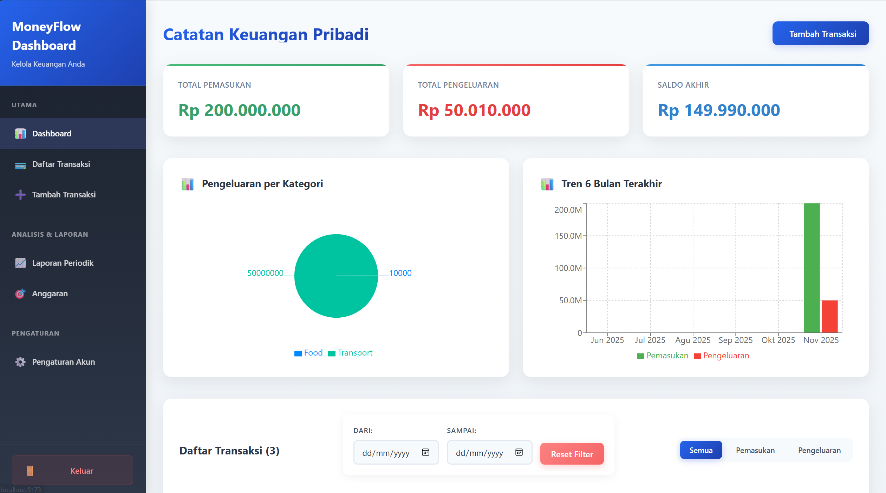
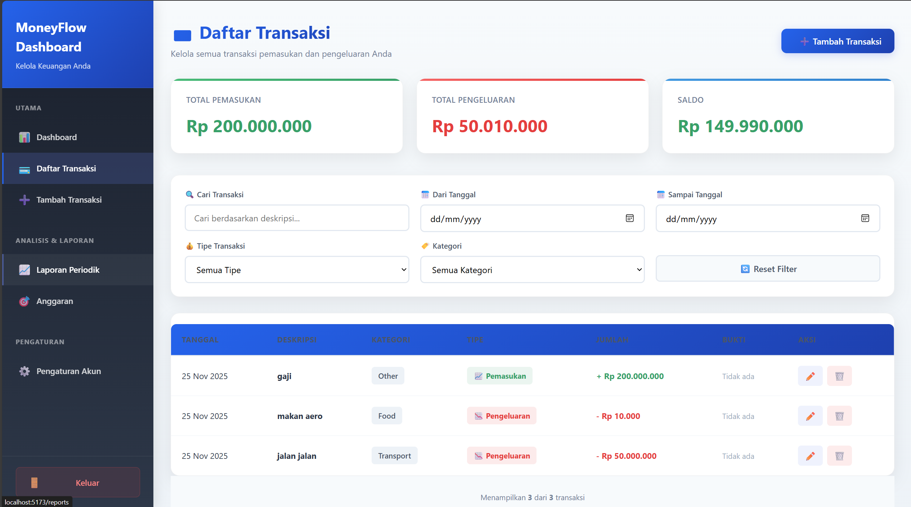
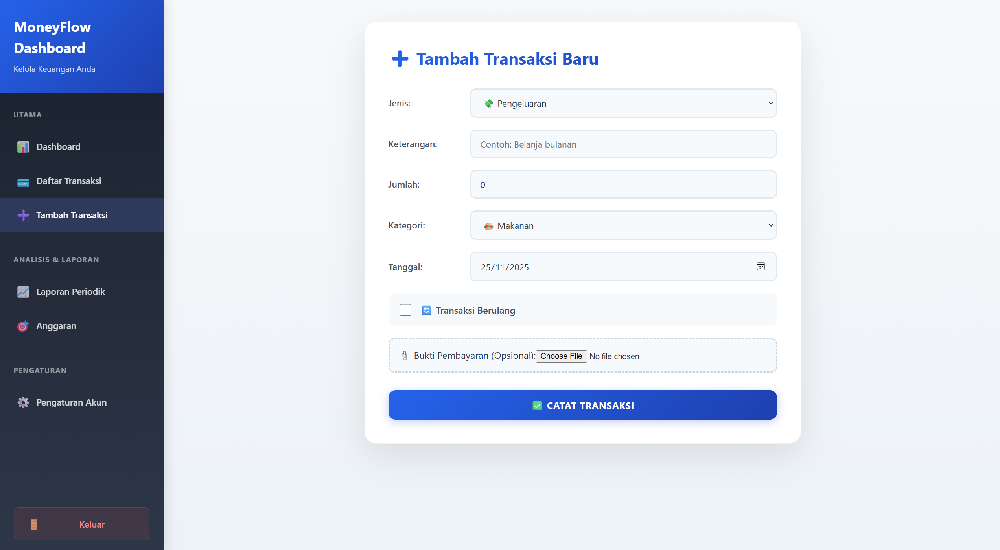
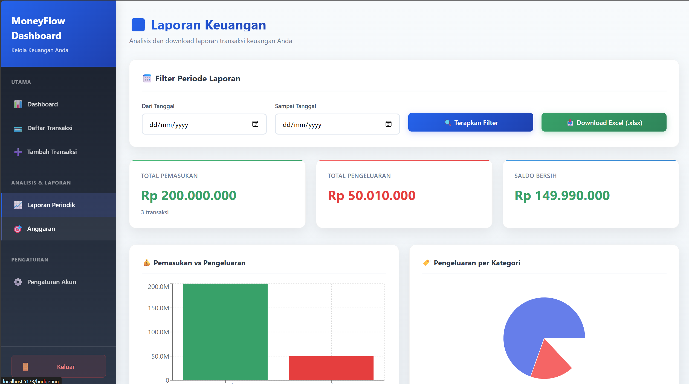
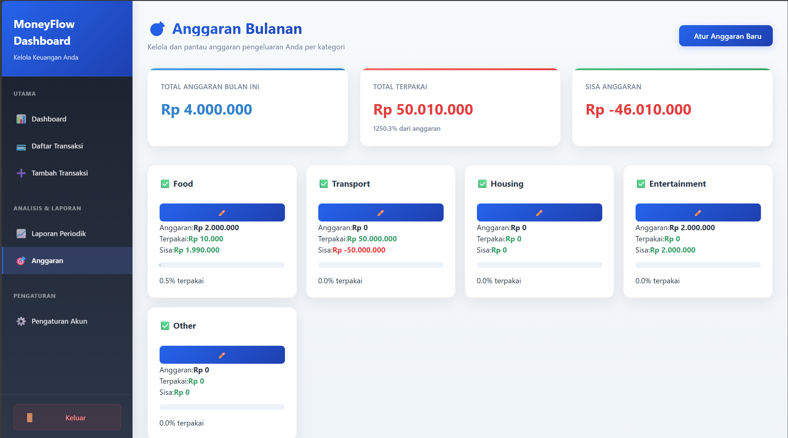
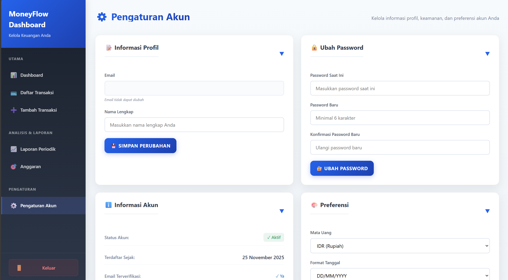
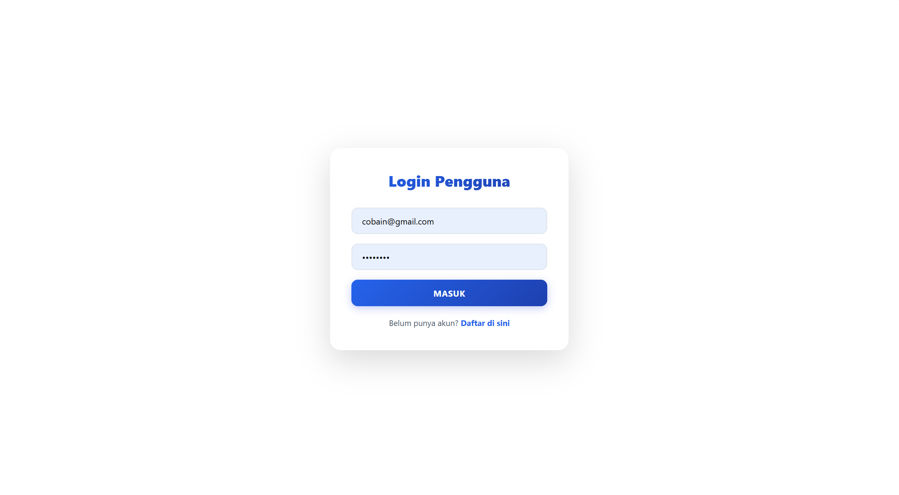
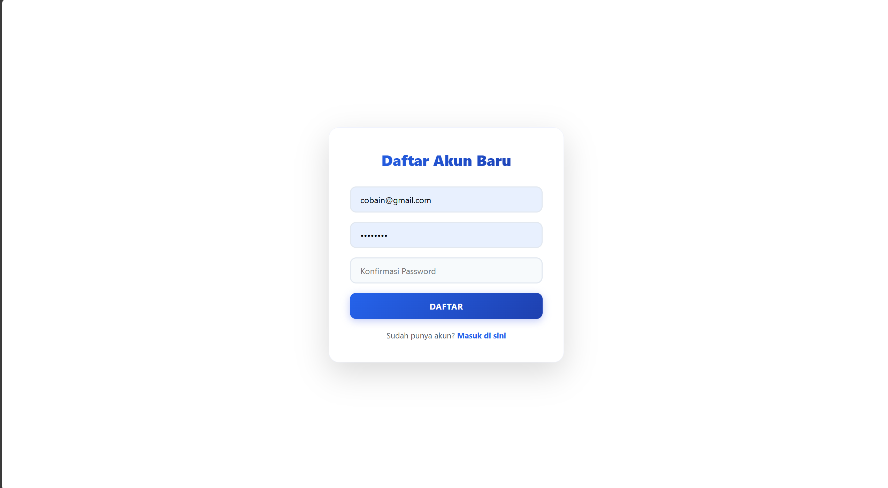

# MoneyFlow Dashboard: Aplikasi Manajemen Keuangan Pribadi Full-Stack

## 📋 Daftar Isi

1. [Demo Aplikasi](#-demo-aplikasi)
2. [Fitur Lengkap](#-fitur-lengkap)
3. [Teknologi Stack](#-teknologi-stack)
4. [Screenshot Aplikasi](#-screenshot-aplikasi)
5. [Instalasi dan Setup](#-instalasi-dan-setup)
---

## Demo Aplikasi

> **Demo Akun:**
> - Email: `coba@gmail.com`
> - Password: `coba1234`

## Fitur Lengkap

###  Dashboard & Visualisasi

- **Ringkasan Keuangan Real-time**: Total pemasukan, pengeluaran, dan saldo dengan kartu interaktif
- **Grafik Analytics**:
  - Bar Chart: Tren pemasukan vs pengeluaran
  - Pie Chart: Breakdown pengeluaran per kategori
  - Line Chart: Tren 6 bulan terakhir
- **Recent Transactions**: 5 transaksi terbaru dengan badge visual
- **Quick Actions**: Akses cepat ke tambah transaksi dan laporan

### Manajemen Transaksi

- **CRUD Lengkap**: Create, Read, Update, Delete transaksi
- **Bukti Pembayaran Digital**:
  - Upload gambar bukti pembayaran (jpeg, jpg, png, gif)
  - Penyimpanan base64 langsung di database (tanpa folder)
  - Preview gambar saat upload
  - View modal untuk melihat bukti dengan zoom
  - Validasi ukuran file (max 5MB)
  - Download/buka di tab baru
- **Multi-Filter System**:
  - Search by deskripsi
  - Filter by tanggal (range)
  - Filter by tipe (Pemasukan/Pengeluaran)
  - Filter by kategori
- **Tabel Interaktif**: Dengan pagination, sorting, dan debounced search
- **Transaksi Berulang**: Support untuk transaksi mingguan, bulanan, tahunan
- **Kategori Lengkap**: Food, Transport, Housing, Entertainment, Other

### Sistem Anggaran (Budgeting)

- **Budget Tracking per Kategori**: Set limit anggaran untuk setiap kategori
- **Progress Bars Visual**:
  - Hijau: < 60% (aman)
  - Oranye: 60-80% (waspada)
  - Merah: > 80% (bahaya)
- **Budget Warnings**: Alert otomatis jika anggaran terlampaui
- **Overall Summary**: Total budget, spent, dan remaining
- **LocalStorage Persistence**: Data anggaran tersimpan lokal
- **Monthly Tracking**: Filter otomatis untuk bulan berjalan

### Laporan Keuangan

- **Export to Excel (.xlsx)**: Download laporan lengkap dengan styling
- **Custom Date Range**: Filter laporan berdasarkan periode
- **Summary Statistics**:
  - Total transaksi
  - Rata-rata pengeluaran
  - Category breakdown
- **Charts Integration**: Visualisasi data dalam laporan
- **Professional Excel Format**:
  - Header styling dengan warna
  - Auto-fit columns
  - Summary section
  - Color-coded income/expense

### Pengaturan Akun

- **Expandable Cards Interface**: 4 kartu yang bisa di-expand/collapse
- **Informasi Profil**:
  - Edit nama lengkap
  - Email (readonly)
  - Auto-save to localStorage
- **Keamanan Password**:
  - Ubah password dengan validasi
  - Current password verification
  - Min 6 karakter
- **Informasi Akun**:
  - Status akun (Active/Inactive)
  - Tanggal registrasi
  - Email verification status
  - Tipe akun
- **Preferensi Personal**:
  - Pilihan mata uang (IDR/USD/EUR/GBP)
  - Format tanggal (DD/MM/YYYY, MM/DD/YYYY, YYYY-MM-DD)
  - Notifikasi email toggle
  - LocalStorage sync

### Autentikasi & Keamanan

- **JWT Authentication**: Token-based secure authentication
- **Password Hashing**: Bcrypt dengan salt rounds
- **Protected Routes**: Middleware untuk route protection
- **Session Management**: Auto-logout on token expiry
- **Secure Password**: Min 6 karakter dengan validation

## Teknologi Stack

### Frontend

| Teknologi        | Versi  | Fungsi                                                 |
| ---------------- | ------ | ------------------------------------------------------ |
| **React**        | 19.2.0 | Library UI untuk component-based architecture          |
| **TypeScript**   | 5.9.3  | Type-safe JavaScript untuk development yang lebih aman |
| **Vite**         | 7.2.2  | Build tool modern dengan HMR super cepat               |
| **React Router** | 7.1.1  | Client-side routing untuk SPA navigation               |
| **Axios**        | 1.7.9  | HTTP client untuk API communication                    |
| **Recharts**     | 3.5.0  | Library charting untuk visualisasi data                |

### Backend

| Teknologi      | Versi  | Fungsi                                |
| -------------- | ------ | ------------------------------------- |
| **Node.js**    | 18+    | JavaScript runtime untuk server       |
| **Express.js** | 4.18.2 | Web framework untuk RESTful API       |
| **MongoDB**    | 6.0+   | NoSQL database untuk data persistence |
| **Mongoose**   | 8.9.5  | ODM untuk MongoDB schema modeling     |
| **JWT**        | 9.0.2  | Token-based authentication            |
| **Bcrypt**     | 5.1.1  | Password hashing untuk keamanan       |
| **CORS**       | 2.8.5  | Cross-origin resource sharing         |
| **ExcelJS**    | 4.4.0  | Generate Excel files di backend       |

---

## Screenshot Aplikasi

### 1. Dashboard - Halaman Utama

Dashboard dengan ringkasan keuangan real-time, grafik analytics (Bar Chart & Pie Chart), dan 5 transaksi terbaru.



---

### 2. Daftar Transaksi

Tabel lengkap dengan multi-filter (search, date range, type, category), CRUD operations, dan pagination.



---

### 3. Form Tambah/Edit Transaksi

Form modern untuk input transaksi dengan kategori, tipe (Pemasukan/Pengeluaran), fitur recurring (Mingguan/Bulanan/Tahunan).



---

### 4. Laporan Keuangan & Export Excel

Visualisasi data dengan charts interaktif dan fitur download laporan ke format Excel (.xlsx).



---

### 5. Sistem Anggaran (Budgeting)

Budget tracking per kategori dengan progress bars visual (hijau/oranye/merah) dan budget warnings.



---

### 6. Pengaturan Akun

Interface dengan 4 expandable cards: Edit Profil, Ubah Password, Info Akun, dan Preferensi Personal (mata uang, format tanggal, notifikasi).



---

### 7. Halaman Login

Halaman autentikasi dengan desain modern dan form validation.



---

### 8. Halaman Register

Form pendaftaran akun baru dengan validation lengkap.



---

##  Instalasi dan Setup

### Prasyarat

Pastikan sistem Anda sudah terinstall:

- **Node.js** (v18 atau lebih baru)
- **MongoDB** (Local atau MongoDB Atlas)
- **Git**
- **npm** atau **yarn**

### 1. Clone Repository

```bash
git clone https://github.com/dimasptrr/Dimas-Muhammad-Putra_5027241076_Tugas-Vibe-Coding.git
cd tugasfullstack
```

### 2. Setup Backend

```bash
cd src/script/backend

# Install dependencies
npm install

# Buat file .env dan tambahkan konfigurasi:
# MONGODB_URI=mongodb://localhost:27017/moneyflow_dashboard
# JWT_SECRET=your_super_secret_jwt_key_here
# PORT=5000

# Jalankan server
npm start
```

Server backend akan berjalan di `http://localhost:5000`

### 3. Setup Frontend

```bash
cd ../frontend

# Install dependencies
npm install

# Jalankan development server
npm run dev
```

Frontend akan berjalan di `http://localhost:5173`

### 4. Akses Aplikasi

Buka browser dan akses:

- **Frontend:** `http://localhost:5173`
- **Backend API:** `http://localhost:5000/api`

## Author

**Dimas Muhammad Putra**

- GitHub: [@dimasptrr](https://github.com/dimasptrr)
- Repository: [Dimas-Muhammad-Putra_5027241076_Tugas-Vibe-Coding](https://github.com/dimasptrr/Dimas-Muhammad-Putra_5027241076_Tugas-Vibe-Coding)

---

<div align="center">

Made with by Dimas Muhammad Putra

</div>
